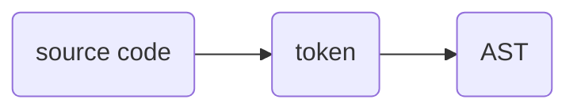

# go-interpreter

트리 탐색 인터프리터 제작

## contents

- [ ] 어휘 분석(lexical analysis, lexing) : 소스 코드를 토큰으로 변환
- [ ] 구문 분석(syntactic analysis, parsing) : 토큰을 추상구문트리(Abstract Syntax Tree, AST)로 변환
  - [ ] parser generator를 사용하지 않고 자체 작성

## 원작

\<writing a interpreter in go\>
